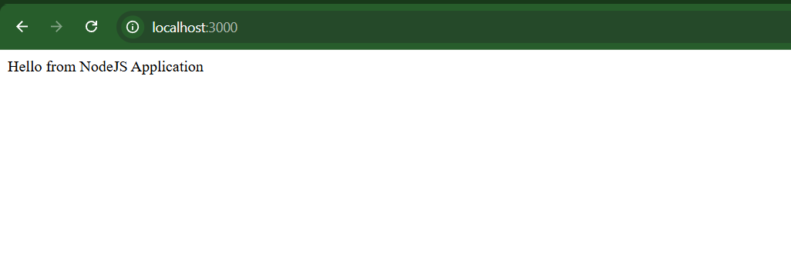
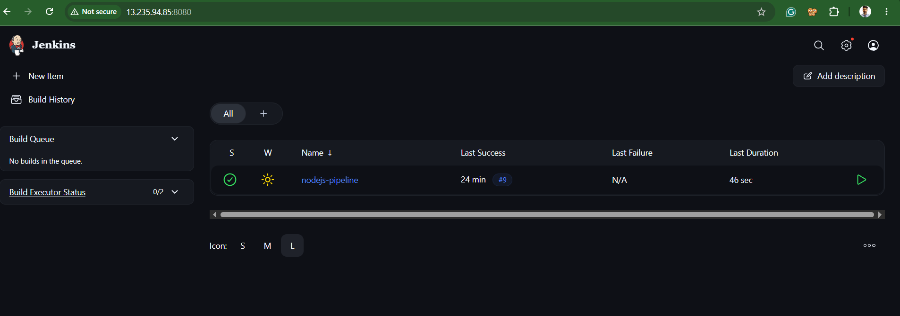
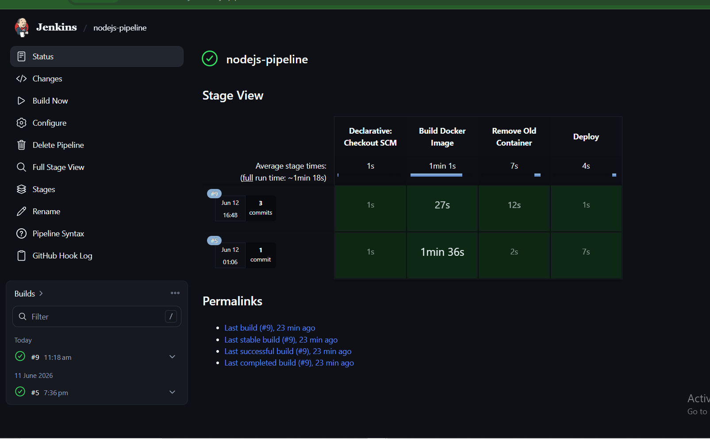
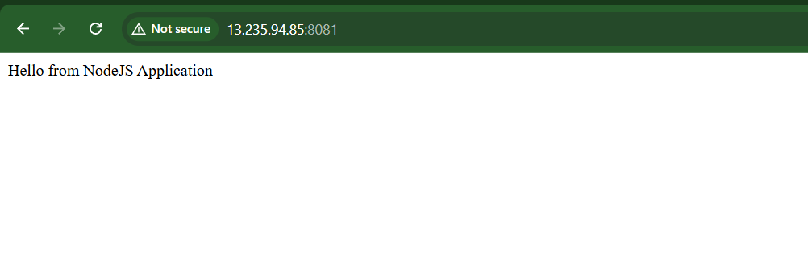
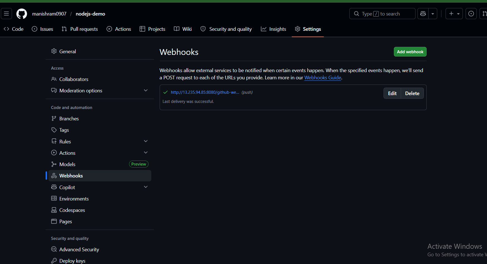
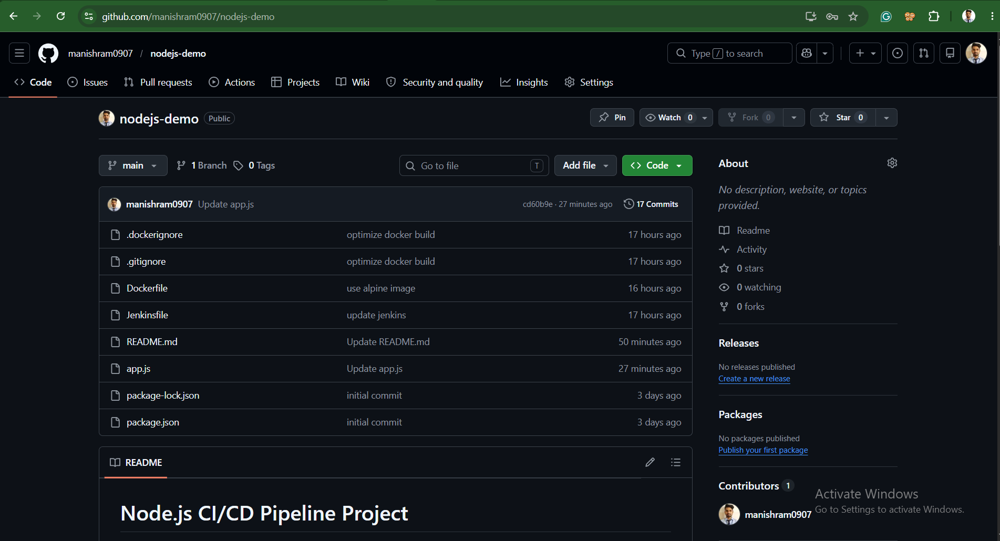

# Node.js CI/CD Pipeline Project

## Overview
This project demonstrates a complete CI/CD pipeline using Jenkins, Docker, GitHub Webhooks, and AWS EC2.

## Architecture

GitHub
   ↓
Webhook
   ↓
Jenkins
   ↓
Docker Build
   ↓
Docker Container
   ↓
AWS EC2

## Technologies Used

- Node.js
- Docker
- Jenkins
- GitHub
- GitHub Webhooks
- AWS EC2
- Linux

## Features

- Automated deployment on GitHub push
- Dockerized Node.js application
- Jenkins Pipeline automation
- Continuous Integration & Continuous Deployment

## Live Application

http://13.235.94.85:8081

## GitHub Repository

https://github.com/manishram0907/nodejs-demo

# Node.js CI/CD Pipeline using Jenkins & Docker

## Application Running

## Jenkins nodejs

##Jenkins Pipelines

## Docker Containers

## GitHub Webhook

## Github

